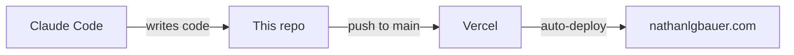

# nathanlgbauer.com

Personal site for Nathan Bauer, a product and partnerships leader in San Francisco.

**🔗 Live: [nathanlgbauer.com](https://www.nathanlgbauer.com)**

<!-- Take a screenshot of the homepage, save as images/screenshot.png -->

## Built with

Designed and built entirely with [Claude Code](https://claude.com/claude-code). No hand-written code. Static HTML/CSS/JS, hosted on Vercel, auto-deployed from this repo.

## Architecture

- **Pages:** plain HTML (`index`, `about`, `work`, `press`, `contact`) with no framework and nothing to break
- **Styling:** vanilla CSS in `css/`
- **Interactivity:** vanilla JS in `js/` (logo ticker animation)
- **Hosting:** Vercel, deploys automatically on every push to `main`

## What I learned

Static HTML was the right call for a five-page site: no build step, no dependencies, and Claude Code can modify any page in a single pass. The trickiest bug was case-sensitive image paths (`Images/` vs `images/`) that worked locally but broke on Vercel's Linux servers.

## Run locally

Open `index.html` in a browser. That's it.
